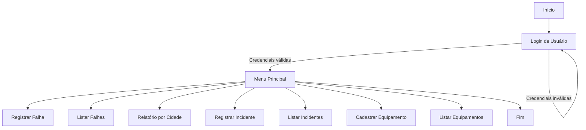

# Arkstorm - Monitoramento de Falhas Energéticas e Cibersegurança

O projeto ARKSTORM é uma aplicação em C# .NET Console baseada no padrão MVC (Model-View-Controller), criada com o objetivo de oferecer uma solução robusta para registrar, acompanhar e analisar falhas energéticas e incidentes cibernéticos, bem como os impactos que causam em equipamentos críticos de serviços essenciais.

- Julia Marques (RM98680)
- Guilherme Morais (RM551981)
- Matheus Gusmão (RM550826)

---

## 🎯 Cenário e Objetivo

Falhas de energia representam uma vulnerabilidade importante, especialmente quando combinadas com ameaças cibernéticas. Em ambientes hospitalares, centros de dados, órgãos públicos e empresas privadas, uma interrupção no fornecimento elétrico ou um ataque digital pode comprometer a segurança física, a integridade dos dados e até vidas humanas.

O ARKSTORM simula um sistema interno de monitoramento de ocorrências reais, acessado por técnicos e responsáveis por infraestrutura. Permite:

- Registrar falhas elétricas
- Registrar incidentes cibernéticos
- Listar e consultar registros históricos
- Registrar equipamentos críticos e seu impacto
- Autenticar usuários autorizados com base em banco de dados Oracle

---

## ✅ Requisitos Funcionais

- Login de usuário com validação no banco Oracle
- Registro de falhas energéticas
- Listagem e busca de falhas por cidade
- Registro de incidentes cibernéticos
- Listagem de incidentes
- Registro e listagem de equipamentos críticos

---

## ⚙️ Tecnologias Utilizadas

- Linguagem: C# (.NET 8)
- Estilo de arquitetura: Console App com padrão MVC
- Banco de dados: Oracle 19c
- Conexão com Oracle: Oracle.ManagedDataAccess.Core
- IDE recomendada: Visual Studio / VS Code

---


---

## 📦 Pacotes NuGet e Dependências

Para o funcionamento do projeto, foi utilizada a seguinte dependência Oracle:

```bash
dotnet add package Oracle.ManagedDataAccess.Core
```

Esta biblioteca permite a conexão direta com bancos de dados Oracle via C# sem uso de Entity Framework. É utilizada em todos os controllers do projeto para executar comandos SQL nativos.


## 📂 Estrutura de Pastas

- Model/ → Entidades de dados (Usuario, FalhaEnergia, Incidente, Equipamento)
- View/ → Interface console (LoginView, ConsoleView)
- Controller/ → Lógica de negócios e acesso Oracle
- Program.cs → Ponto de entrada da aplicação

---

## 🛠️ Scripts de Criação de Tabelas (Oracle)

Execute os comandos abaixo no Oracle SQL Developer:

```sql
CREATE TABLE USUARIOS (
    ID NUMBER GENERATED BY DEFAULT AS IDENTITY PRIMARY KEY,
    USERNAME VARCHAR2(50) NOT NULL UNIQUE,
    SENHA VARCHAR2(50) NOT NULL
);

CREATE TABLE FALHAS_ARC (
    ID NUMBER GENERATED BY DEFAULT AS IDENTITY PRIMARY KEY,
    CIDADE VARCHAR2(100),
    DESCRICAO VARCHAR2(255),
    RISCO VARCHAR2(50),
    DATAHORA TIMESTAMP
);

CREATE TABLE INCIDENTES_ARC (
    ID NUMBER GENERATED BY DEFAULT AS IDENTITY PRIMARY KEY,
    TIPO VARCHAR2(100),
    DESCRICAO VARCHAR2(255),
    IMPACTO VARCHAR2(100),
    DATAHORA TIMESTAMP
);

CREATE TABLE EQUIPAMENTOS_ARC (
    ID NUMBER GENERATED BY DEFAULT AS IDENTITY PRIMARY KEY,
    NOME VARCHAR2(100),
    LOCALIZACAO VARCHAR2(100),
    IMPACTO VARCHAR2(100),
    DATAHORA_REGISTRO TIMESTAMP
);
```

---

## 🧪 Inserts de Teste

```sql
INSERT INTO USUARIOS (USERNAME, SENHA) VALUES ('admin', '1234');

INSERT INTO FALHAS_ARC (CIDADE, DESCRICAO, RISCO, DATAHORA)
VALUES ('São Paulo', 'Queda de energia em subestação central', 'Alto', SYSTIMESTAMP);

INSERT INTO INCIDENTES_ARC (TIPO, DESCRICAO, IMPACTO, DATAHORA)
VALUES ('Ataque DDoS', 'Ataque à central elétrica', 'Sistema offline', SYSTIMESTAMP);

INSERT INTO EQUIPAMENTOS_ARC (NOME, LOCALIZACAO, IMPACTO, DATAHORA_REGISTRO)
VALUES ('Servidor Central', 'Data Center 1', 'Paralisação de serviços web', SYSTIMESTAMP);
```

---

## 🚀 Execução

1. Clone o repositório
2. Configure a string de conexão no LoginController e nos outros controllers Oracle
3. Compile o projeto com:
```bash
dotnet build
```
4. Execute com:
```bash
dotnet run
```

---


---

## ✅ Requisitos Funcionais

- O sistema deve permitir login de usuários com validação no banco de dados Oracle.
- Deve permitir o registro de falhas energéticas, com dados como cidade, descrição, risco e data/hora.
- Deve listar todas as falhas registradas.
- Deve gerar um relatório filtrando falhas por cidade.
- Deve registrar incidentes cibernéticos com tipo, descrição e impacto.
- Deve registrar equipamentos críticos com nome, localização e impacto esperado.
- Deve listar os equipamentos cadastrados.

## ❌ Requisitos Não Funcionais

- O sistema deve ser escrito em linguagem C# com estrutura modular (MVC).
- A persistência deve ser realizada em banco de dados Oracle, com conexão via Oracle.ManagedDataAccess.Core.
- A interface será via console (texto).
- O sistema deve apresentar tratamento de exceções via try-catch.
- O tempo de resposta para listagens deve ser menor que 2 segundos para até 100 registros.
- O código deve ser legível, indentado e comentado.

---

## 📈 Fluxograma do Sistema (Mermaid)




## 📌 Considerações

- Toda a estrutura de tabelas deve ser criada externamente no banco de dados.
- O sistema lida com falhas e exceções usando try-catch.
- O código é modular e pronto para expansão com novas funcionalidades.

---